# Market Forecasting
> [Italiano]() / **English**
>
> _Note: The training dataset and the benchmark implementation are not included in this repository due to licensing concerns._

### Summary
This project focuses on forecasting equity, bond, and liquidity market indeces from time series, over a 65 days horizon.

The dataset is made up of 19 columns containing 3 different asset classes: equity, bond, and liquidity covering the period from 2015 to 2019.
The last 65 days of the dataset are used as testing subset and the remaining previous part as training subset.
The benchmark is Armundia Group’s GRNN model I obtained for the final project of the university course in Machine Learning.
The improvement metric is the percent reduction in mean absolute error (MAE) for each asset, which is defined as follows:

where _Y_ is the actual value of the test set, _y_ is the model’s forecast, and _n_ is 65, the forecasting horizon. 

I trained a gradient boosting model for each index, instead of a common GRNN for all the indexes, and optimized the pipeline through genetic evolution with H2O.ai Driverless AI.

Gradient boosting models are ensemble learners, they make use of groups of decision trees to outperform the simple regressors taken singularly.

## Results
As stated before, the benchmark is a GRNN model. I’m comparing the results of the new models against the predictions that came with the original project dataset and notebook.
Gradient boosting models brought an average ~27% reduction in mean absolute error in post cumulative yields and a ~90% reduction in pre cumulative ones.

### Improvement
The detailed results of the % reduction in MAE are represented in the following table.
Higher % means better accuracy and negative values mean worse predictions.

| Index | Pre | Post |
| ----- | -----| ----- |
| MXEM |  95.2 % |  72.0 % |
| MXEU |  93.6 % |  68.1 % |
| MXNA |  77.8 % |  -38.4 % |
| MXEF |  94.6 % |  -76.0 % |
| MXJP |  90.5 % |  57.2 %|
| MXPC |  94.0 % |  61.2 % |
| JPMGEMLC |  83.6 % |  35.5 % |
| JNUCUK |  76.9 % |  75.8 % |
| SBF14T |  90.1 % |  59.0 % |
| ER00 |  92.6 % |  -48.9 % |
| UC00 |  85.9 % |  23.3 % |
| JNUCUS |  96.0 % |  61.4 % |
| C0A0 |  94.0 % |  63.7 % |
| JPEGCOMP |  95.1 % |  61.7 % |
| JNUCJP |  76.7 % |  20.4 % |
| JC00 |  70.7 % |  -69.4 % |
| JPCAEU3M |  99.6 % |  9.8 % |
| JPCAGB3M |  99.3 % |  -13.9 % |
| JPCAUS3M |  99.9 % |  89.1 % |
| Average |  89.8 % |  26.9 % |

### Plots

  
  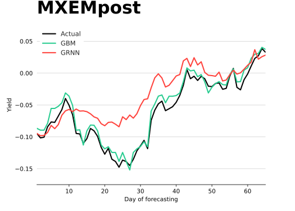

  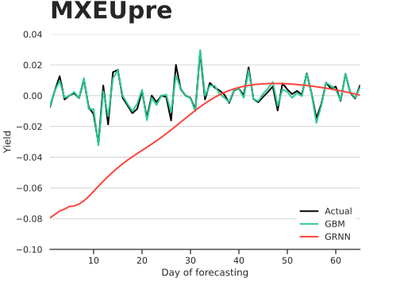
  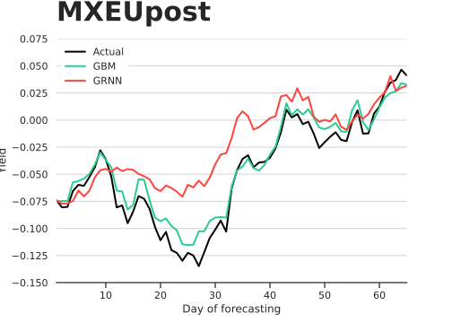

  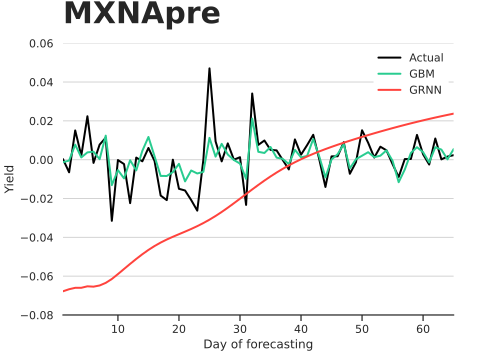
  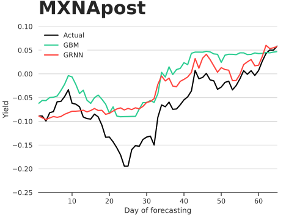

  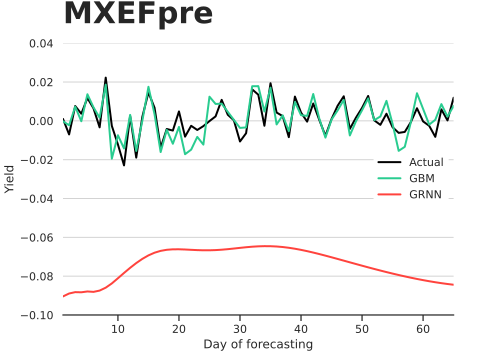
  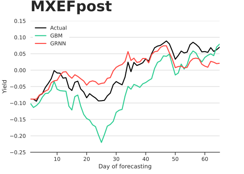

  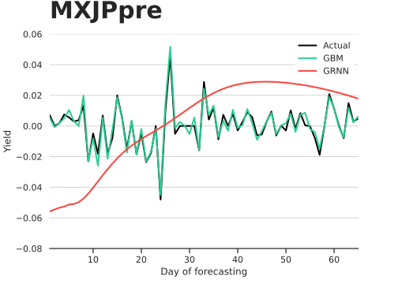
  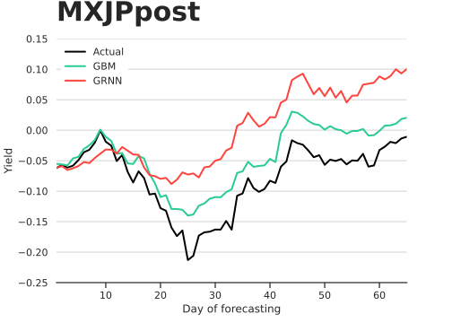

  

  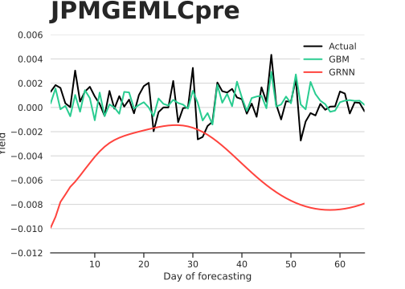
  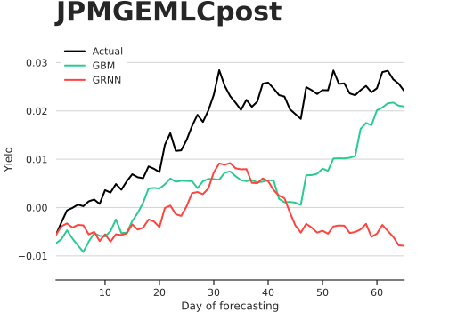

  
  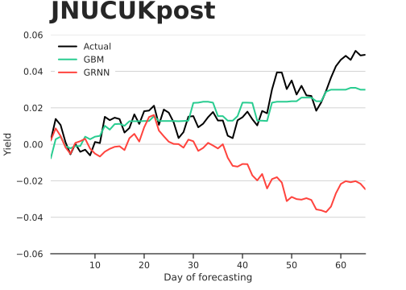

  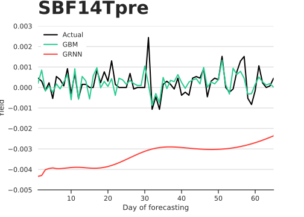
  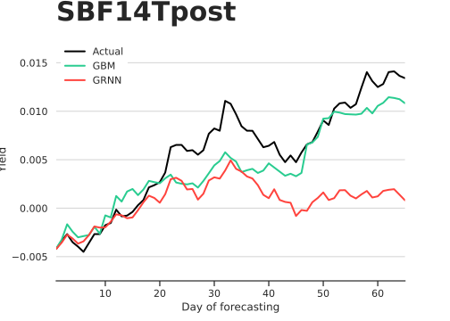

  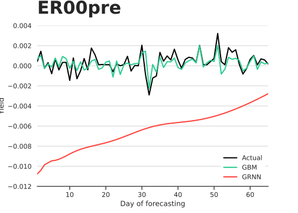
  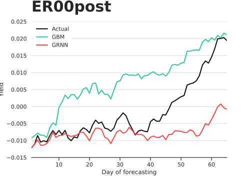

  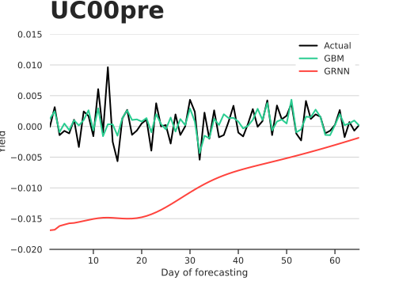
  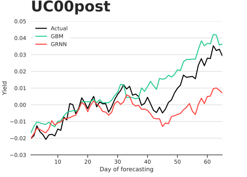

  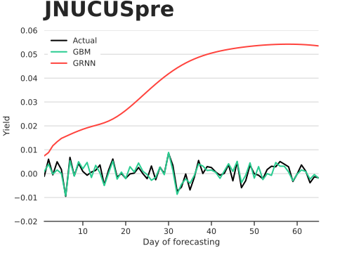
  

  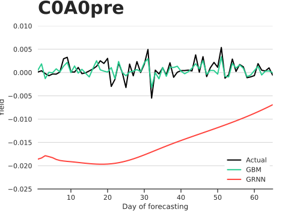
  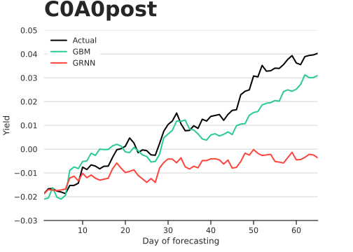

  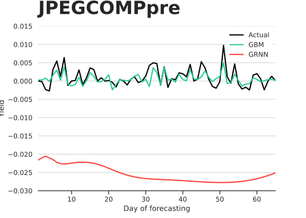
  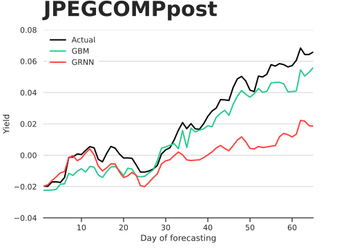

  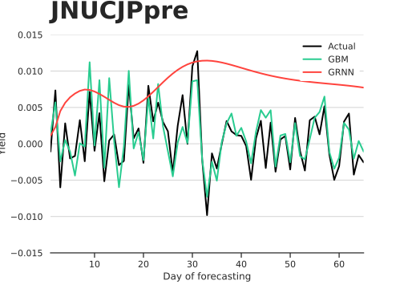
  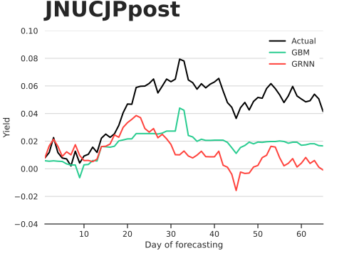

  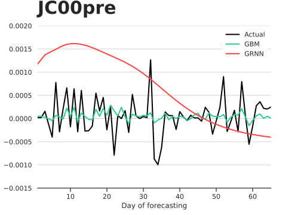
  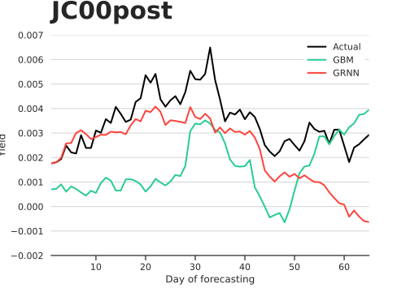

  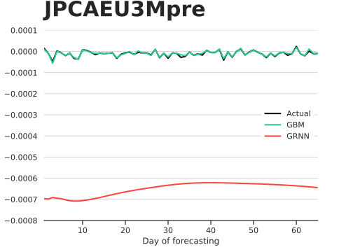
  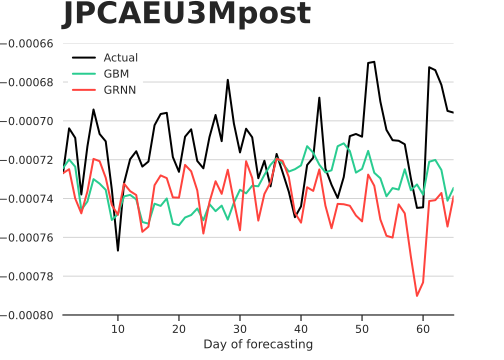

  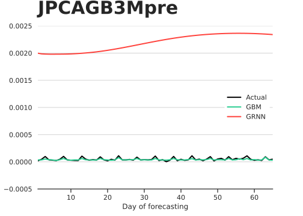
  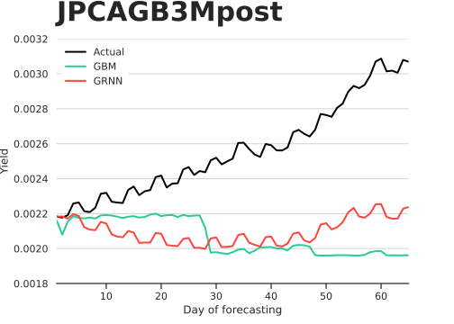

  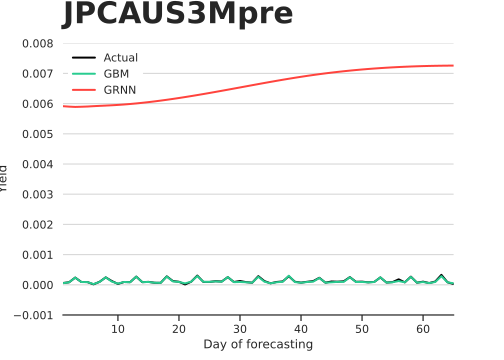
  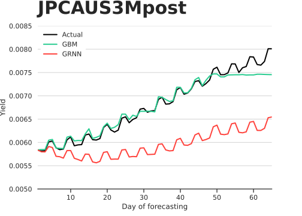

## Conclusions
The new models are overall better than the GRNN but of course, they aren’t perfect if we look at the post cumulative performances.
In some isolated indexes, the new models didn’t outperform the benchmark and require further tuning and engineering.
Gradient boosting models however brought a stable overall reduction in forecasting error in the pre cumulative yields (90%).

In conclusion what could be furtherly improved?

1. Adjusting the training data for inflation over the observations time-frame.
1. Updating the dataset extending the period covered by observations. Some indexes extend for decades and the available dataset covers ~5 years.
1. Increasing sampling frequency, adding intraday asset data.
1. Disaggregate the index composition.
1. Introduce more assets and/or exogenous features that can impact the prediction, like macroeconomic indicators, notable events, and local holidays.
1. Augment the dataset using signal processing metrics: moving average, exponential smoothing, LOESS regression, cross-covariance, cross-correlation, feature interaction.
1. Introduce a natural language processing component based on news streams and financial docs, like SEC reports and analysts’ predictions.

Finally, we should take a look at the research side.
As of today, the state-of-the-art for multi-variate time series forecasting seems to be [GRU-ODE-Bayes networks](https://arxiv.org/abs/1905.12374), this kind of Neural Ordinary Differential Equations should be explored too.

[**Go back to index >**](https://github.com/MattiaVerticchio/PersonalProjects/blob/master/README_EN.md)
